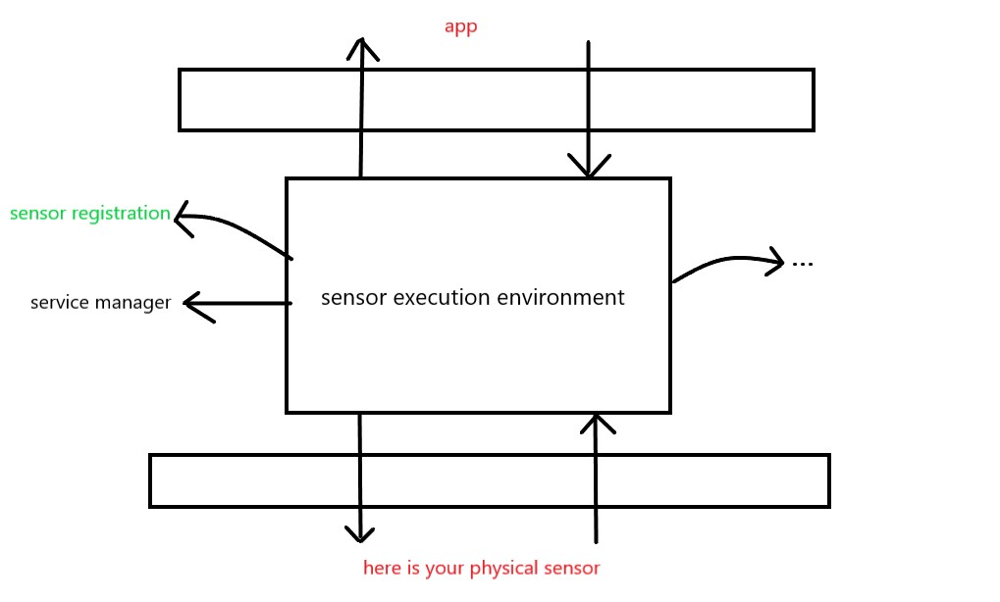
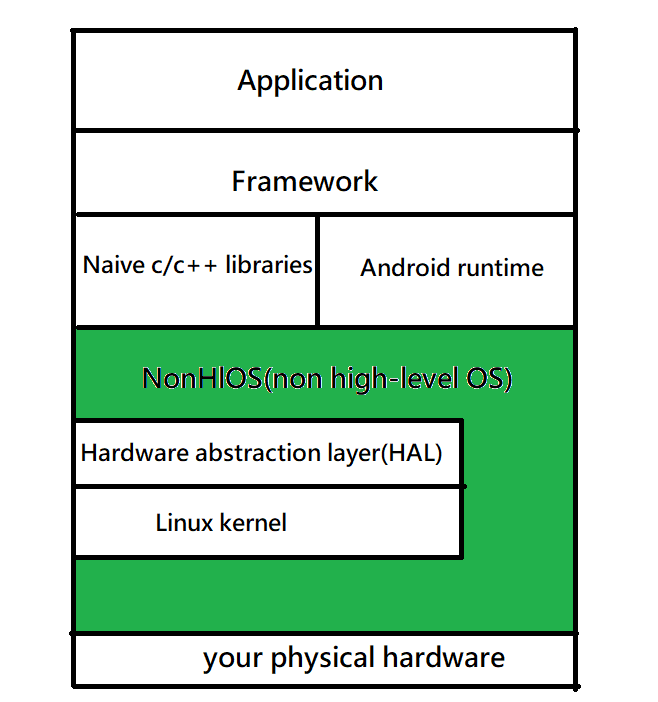
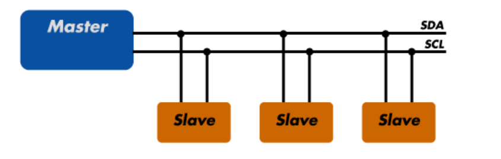

# accelerometer-and-gyro-sensor
An overview of how to bring up sensor using Qualcomm Sensor Hub

## Information
* SOC platform: Qualcomm QCS6490
* Platform info: IDP
* Communication bus: I²C

## Outline
* Introduction
* Architecture of sensor
* Implementation
* Result


## Introduction
Due to confidential policy of Qualcomm, this tutorial won't involve in too many details. Instead, we just demonstrate how to bring up accelerometer-and-gyro-sensor(A+G) sensor on Qualcomm's platform.

## Architecture of sensor
Following picture is the structure of Qualcomm's sensor hub.



As you can see in the figure, there are mainly three components:
* app
* sensor execution environment(SEE) including Snapdragon Sensor Core(SCC)
* physical sensor

This diagram drastically simplies the actual structure but the idea is SEE framework is responsible for provides services to sensors, manages registry, handles client interface etc.

As a result, we'll mainly work on SEE. Then here comes a question:</br>
How does the diagram map to Android OS architecture?

Before that we need to talk about what non-hlos is:</br>
>non-hlos can be considered the core BSP and other supported software package, which performs the bare minimum functionalities at system boot-up including loading the High Level OS(Linux/ Android/ Windows). Non-hlos is typically provided by the vendors owning the hardware(HW) platform.

>So it will be something like the following diagram I draw:
Sometimes you see people say non-HlOS software is located below the Linux kernel layer and above the hardware and sometimes you see statement like non-HLOS software communicates with the Linux kernel through the Hardware Abstraction Layer (HAL). They both are correct because "non-hlOS includes firmware and device drivers". 



Back to the problem, the actual mapping between sensor execution environment(SEE) and Android OS architecture is basically on nonhlos layer. This makes sense since we have physical sensors and we want it to be integrated into Android OS thus non-hlos takes the role.

Thanks to the fact hardware(HW) platform vendors seem nonhlos as their proprietaries, nonhlos often contains well-structured model according to the one they propose (in the case is SEE).

File you need to change varies according to the chipset and platform you use and I will use Qualcomm QCS6490 as exmaple.
It is very likely that you can find files I change at your platform with (since the file name may not change):
* Linux find command
* Linux grep command

## Implementation
<b>To bring up sensors, we need to add device driver and register that sensor on the system so that upper layer application can get sensor data or information. </b> </br>

We split it into two parts: device(sensor) driver and registry. Let's look at device driver first.</br>

### Device(sensor) driver
Ask for the device(sensor) driver from the sensor vendor's FAE engineer. Copy the entire driver folder to path:
```
nonhlos/adsp_proc/ssc_drivers/${your_device_driver}
```
> As a side note, Qualcomm has the so called "preferred vendor list" which is some sensors that can use directly without the need of bring up. If you don't have the same path as mine above, you can find where Qualcomm puts other preferred vendor list sensor's driver. After finding the location, paste your device driver there.

Then we need to add the newly added device(sensor) driver to the config file so that it will get compiled. To do so, add driver to path
```
adsp_proc\ssc\chipset\[platform]\por.py
```
And do the following changes:
```
#POR sensors list
   include_sensor_vendor_libs.extend(['lsm6dst',
                                      ...
                                      'sns_bu52053nvx'])
   include_sensor_vendor_libs.extend(['YourDriver'])  //<<<Add custom driver here>>>

   # 1. Island drivers
   env.AddUsesFlags(['SNS_ISLAND_INCLUDE_LSM6DST'])
   ...
   env.AddUsesFlags(['SNS_ISLAND_INCLUDE_TMD2725'])
   <<<Add custom driver build flag here to include in island if required>>>
```
### Registry
Then we need to registry our sensor, sometimes you may see people say "push registry files", it's basically the same thing. The registry file primarily contains your hardware configuration.</br>
You need to push registry at path: </br>
```
/vendor/etc/sensors/config/
```
This path may vary depends on your current Android BSP version.</br> 

Then how to push registry file?</br>
 Basically Qualcomm SEE use a json file as a sensor config file. Contrary to the old Qualcomm sensor architecture, there's no file like "sensor_def_qcomdev.conf" in this new architecture. And you may see statements like you need to register two json files for your sensor, one for the platform-specific and another for the sensor driver. But as for my case or maybe in this new architecture, I just need platform-specific configuration.</br>

 I will only talk about import setting on json file simply since this part is seen as proprietary of Qualcomm.
First step you can get json config file for this sensor from vendor's FAE engineer, if they don't provide you then just copy the content of arbitray json config file (please at least copy the "same" type of sensor) and create a json file at the path above then paste that content.

Then you may get something like this:
```
{
  "config":{
    "hw_platform": ["MTP", "Surf", "RCM", "QRD", "HDK"],
    "soc_id": ["356"]
  },
  ...
  },
  "icm4x6xx_0_platform":{
    "owner": "icm4x6xx",
    ".config":{
      "owner": "icm4x6xx",
      "bus_type":{ "type": "int", "ver": "0",
        "data": "3"
      },
      "bus_instance":{ "type": "int", "ver": "0",
        "data": "1"
      },
      "slave_config":{ "type": "int", "ver": "0",
        "data": "0x68"
      },
      ...
      "dri_irq_num":{ "type": "int", "ver": "0",
        "data": "123"
      },
      ...
    },
    ...
  }
}
```

Let's go through the import settings one by one:
(You can get more details on Qualcomm's document: Sensors Execution Environment (SEE) Sensors Deep Dive)
* First thing you might need to change are hw_platform and soc_id.
    * You can check hw_platform using the command in adb shell:
        ```
        cat /sys/devices/soc0/hw_platform
        ```
    * You can check soc_id with command:
        ```
        cat /sys/devices/soc0/soc_id
        ```
        
* Second, check with hardware team the pin number of interrupt gpio and change dri_irq_num with corresponding one:
```
"dri_irq_num":{ "type": "int", "ver": "0",
    "data": "your_interrupt_gpio_pin_number"
}
```

* Third, check with hardware team how your sensor communicates with SOC(System on a Chip). In my case, the way of communication is through I²C. The I²C structure is as following diagram.</br>



 The I²C communication protocol uses only two bidirectional open collector or open drain lines, Serial Data Line (SDA) and Serial Clock Line (SCL). As you can see in the diagram, there can be multiple "slaves". Since those slaves share the same SDA and SCL, we need the so called "slave address" to distinguish between them. Thus, in this part, you need to set the way of communication your sensor uses, the SDA and SCL gpio pin numbers and slave address.
 
 * To set the way of communication, just change bus_type data:</br>
 0 means I²C; 1 means: SPI bus; 3 means I3C (You can found these in Qualcomm's document)
 ```
 "bus_type":{ "type": "int", "ver": "0",
    "data": "0"
}
 ```
 * Then we need to set the SDA and SCL gpio pin numbers. Usually hardware platform vendor reserve some set of gpios as I²C. They will encapsulate those gpios and we just use them. In Qualcomm, they design normal gpio pin number from 159 ~ 174 as what they call "SSC GPIO". That is:</br>
 ```
GPIO_159~GPIO_174 == SSC_0~SSC_15
 ``` 
So in my case, I use gpio 161 and gpio 162 as my SDA and SCL. These gpios map to SSC_2 and SSC_3. And then Qualcomm use QUP to wrap SSC_${number}. For example, SSC_2 and SSC_3 are mapped to QUP2</br>
   
*  How do we know this GPIO mapping?</br>
    * You can refer to the table in Qualcomm's document: 80-PT831-24_AA page 12. 
    * Or you can check following files for more information:
    ```
    adsp_proc\core\settings\buses\qup_common\config\kodiak\adsp\ssc\up_devcfg.c,  adsp_proc\core\settings\buses\qup_common\config\kodiak\adsp\ssc\Qup_instance_mapping.c adsp_proc\core\settings\buses\qup_common\config\kodiak\adsp\ssc\ Qup_devcfg.json
    ```

We set SDA abd SCL gpio pin numbers through QUP_${number} and set ${number} to bus_instance:
```
"bus_instance":{ "type": "int", "ver": "0",
    "data": "2"
}
```

Lastly, set the slave config. You can ask hardware team or sensor vendor's FAE for this information. In my case, slave address is 104.
```
"slave_config":{ "type": "int", "ver": "0",
    "data": "104"
}
```

That's generally how a sensor is brought up in Qualcomm's sensor hub. Of course there are some configs like interrupt type, sensor frequency etc. you might need to change. But I don't think that will be a problm. You can reference Qualcomm's document to do so.</br>

### Then how do we know a sensor is actually brought up?
You can type the following command:
```
adb root
1) adb shell ssc_sensor_info > ssc_sensor_info.txt
2) adb shell see_workhorse > see_workhorse.txt
*** 1~2 for checking whether sensor has been brought up in ADSP ***
```
If you found your sensor in the files then your sensor is successfully brought up!

## Result for accelerometer-and-gyro-sensor
https://user-images.githubusercontent.com/57974543/213348656-32ace940-7305-4858-b720-753fd0ba7849.mp4

## Remarks
All sensors that use Qualcomm sensor hub can be brought up in the same way. So you can bring up light sensor, magnetic sensor etc. without pain.

## Result for light sensor
https://user-images.githubusercontent.com/57974543/213349832-0ec53439-a255-4175-b774-7cafa6f267ec.mp4


